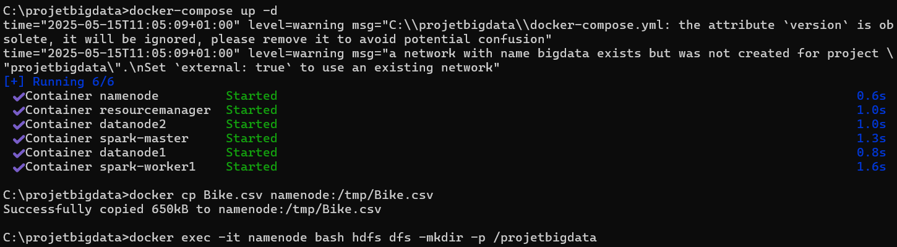
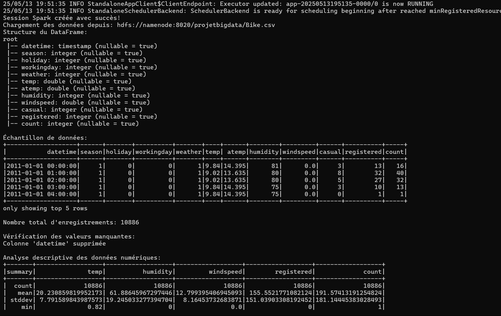
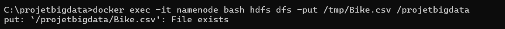
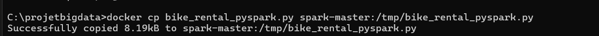

## 🚴‍♂️📈 Bike Rental Analysis with PySpark ⚡
Bienvenue dans ce projet Big Data où nous analysons les locations de vélos en utilisant Apache Spark via PySpark dans un environnement Dockerisé ! 🐳✨

## 📦 Objectifs du Projet

👉 Charger des données de location de vélos depuis HDFS
👉 Réaliser un nettoyage et une exploration des données
👉 Construire et entraîner un modèle de régression par arbre de décision 🌳
👉 Évaluer les performances du modèle 📊
👉 Comparer avec un modèle naïf (moyenne) pour évaluer l'amélioration ✅

## 🗂️ Arborescence

projetbigdata/
├── Bike.csv                    # 📄 Jeu de données
│
├── bike_rental_pyspark.py      #  Script PySpark
│
├── images/                     # 📸 Dossier pour tes captures d'écran
│   │
│   ├── pyspark_test1.png
│   │
│   ├── pyspark_test2.png
│   │
│   ├── img1.png
│   │
│   ├── img2.png
│   │
│   ├── img3.png
│   │
│   ├── img4.png
│   │
│   └── img5.png
│
├── docker-compose.yml
│
├── Dockerfile.spark
│
└── README.md                   # 📖 Documentation du projet

## 📊 Données utilisées

## 📂 Bike.csv contenant :

datetime 🕰️

saison 🌸🌞🍂❄️

conditions météo ☁️🌧️🌞

température 🌡️

humidité 💧

vitesse du vent 🌬️

nombre d'utilisateurs enregistrés et occasionnels 👥

total de locations 📈

## 🚀 Déploiement & Exécution

### 1️⃣ Configuration Initiale
#### Configuration du Cluster

### 2️⃣ Démarrage de l'Environnement
#### Lancement de l'Environnement

Lancer l'environnement distribué:
```bash
docker-compose up -d
```



*Démarrage des conteneurs Docker et initialisation des services*

### 3️⃣ Tests PySpark
#### Test PySpark 1


*Premier test de l'environnement PySpark*

#### Test PySpark 2

*Vérification de la configuration PySpark*

### 4️⃣ Interface et Monitoring
#### Interface de l'Application

*Interface utilisateur pour le monitoring et la gestion*

### 5️⃣ Résultats de l'Analyse
#### Résultats de l'Analyse

*Résultats de l'analyse des données et des prédictions*

### 6️⃣ Visualisations Finales
#### Visualisations Finales

*Représentations graphiques des résultats finaux*

## 📥 Transfert du dataset dans HDFS

```bash
docker cp Bike.csv namenode:/tmp/Bike.csv

docker exec -it namenode bash
hdfs dfs -mkdir -p /projetbigdata
hdfs dfs -put /tmp/Bike.csv /projetbigdata/

hdfs dfs -ls /projetbigdata
```

## 📥 Déploiement et exécution du script PySpark

```bash
docker cp bike_rental_pyspark.py spark-master:/tmp/bike_rental_pyspark.py 
```

```bash
docker exec -it spark-master /opt/bitnami/spark/bin/spark-submit \
    --master spark://spark-master:7077 \
    --conf spark.executor.memory=2g \
    --conf spark.driver.memory=2g \
    /tmp/bike_rental_pyspark.py 
```

📝 Auteurs
👩‍💻 Samah Saidi